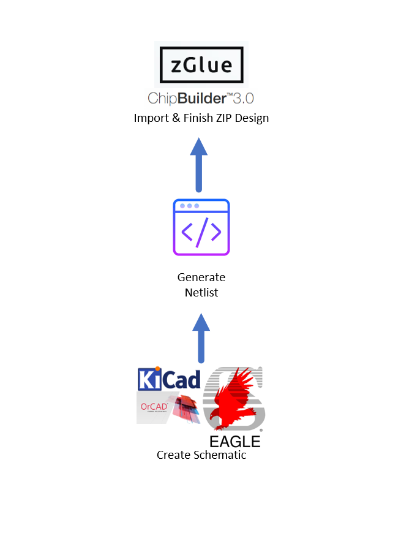

Netlist Import Specification
****************************

Version: 1.0

Author(s): Jorge L. Rojas

zGlue Inc, 883 N Shoreline Blvd, C200, Mountain View, CA 94043, USA

Contact: jorge@zglue.com

*Released under ZEF License v. 1.0, a copyleft license adapted from the GNU General Public License (GPL) 3.0 for the purpose of open source development*

Background
==========

To share design information between ChipBuilder and other schematic capture tools, the former supports importing a SPICE netlist to port a schematic into zGlue's ZIP design tool. This repository shows a high-level design flow and specification for this feature. The latter includes a description of the netlist format and ChipBuilder symbols required to create your schematic. In addition, a few guidelines are listed to ensure that the components used can be successfully integrated in a ZIP chip. For an implementation example, please go through `this OrCAD ZIP design <https://github.com/zglue/zip-orcad-design>`_, which not only serves as a tutorial, but also works as a template to create your own ZIP schematics using OrCAD Capture. The specifications and design flow description in this repository are being released by zGlue Inc under the ZEF copyleft license.

Netlist Import Design Flow
==========================

A successful implementation of the "Netlist Import" feature requires three parts: a completed schematic, a ChipBuilder symbols library, and a GUI tool/script that generates the netlist according to the specifications below. Once the netlist is created, it's imported into ChipBuilder. After importing, the chiplets will be placed in the SmartFabric and the schematic will be ported. Lastly, modify the chiplet placement, make the package design, and route the system to complete the system.

Flow Diagram
------------

.. _figure_ftdi_drivers:

Netlist Generation
------------------

Most schematic capture tools have scripting capabilities that allow a user to programmatically access properties of a project. That feature allows a user to create a script that generates a netlist which follows the format specified in this repository. Also, some of these tools may already have utilities to create netlist from a schematic. zGlue already offers a script to generate the netlist for OrCAD Capture on the template linked in the ``Background`` section; nonetheless, it's possible to adapt the script to different schematic capture tools. Feel free to explore your tool of choice, before porting the netlist generatior script.

Importing the Netlist
---------------------

To import the netlist in a new ChipBuilder system follow the steps below:

* Log-in to ChipBuilder
* Click on ``Create new ZiP``
* Provide a system name
* Select ``Zeus2`` as the architecture
* Select ``64 x 44`` as the tile size
* Click on ``import from Spice Netlist`` and select the appropriate file.
* Click on ``Save``

These steps are demonstrated on the GIF below:

.. image:: media/cb_netlist_feature.gif

What's Included?
================

* ChipBuilder netlist import flow
* ChipBuilder netlist format specification
* ChipBuilder symbols library specification
* ZEF Copyleft License (ZEF License v. 1.0)
